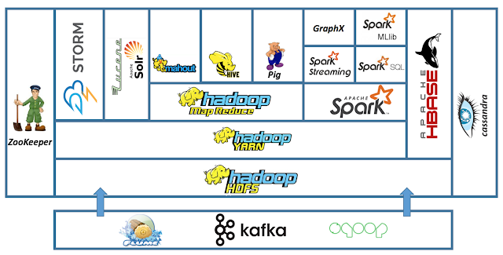

# Hadoop
자바 기반의 오픈소스 프레임워크

### 하둡을 왜 쓰는가?
하나의 컴퓨터에서 처리할 수 없는 대용량의 데이터를 나누어 처리하기 위해 사용

#### 장점
- Computing power : 다수 CPU, RAM 이용 가능
- Fault tolerance : Cluster를 구성하는 Node 중 일부가 죽어도 복구 가능
- Flexibility : 다수의 언어 지원, 비-구조적 데이터를 필요할 때 구조적 데이터로 변환
- Low cost : 대용량 데이터 처리 비용이 RDBMS에 비해 훨씬 저렴
- Scalability : 추가 성능이 필요할 때, 확장이 용이

#### 하둡의 기본은 다음과 같이 구성됨
- HDFS (Hadoop Distributed File System)
  - 하둡 분산 파일 시스템
- MapReduce
  - 분산 처리 프레임 워크
- YARN (yet another resource negotiator)
  - 클러스터 자원 관리

위 기반을 바탕으로 Hive, Hbase, Spark, Pig, Mahout 등의 application 생태계가 구성됨

[Image Source](http://blog.newtechways.com/2017/10/apache-hadoop-ecosystem.html) - 위 그림은 간략한 하둡 생태계, 실제로는 훨씬 많다.

### 기본 설정
VirtualBox - hortenworks sandbox 이용
data source - [GroupLens Research](https://grouplens.org/datasets/movielens/)의 ml-100k 이용

1. **Web interface**
 - http://127.0.0.1:8888/ 로 접속

1. **CMD 명령어**
  - Putty, ssh, http://127.0.0.1:4200/ 등으로 HDFS의 명령행에 접근이 가능하다.
  - 일반적인 linux 명령어 사용 가능
  - root 권한이 없으면 각 노드의 filesystem만 조작이 가능. 필요시 `sudo su` 혹은 루트 계정으로 로그인
  - Hadoop File System 조작예) `hadoop fs -ls`

## HIVE
하둡 시스템의 데이터베이스
- HiveQL을 맵리듀스 작업으로 변환하고 하둡 환경에서 실행
- 관계형 데이터베이스는 아니지만, SQL 기반 명령어 사용 가능

## Spark
맵리듀스와 유사한 클러스터 컴퓨팅 프레임 워크
