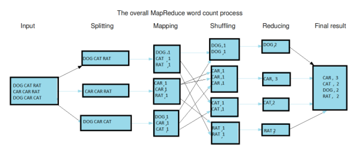

# MapReduce
하둡의 분산 처리 프레임워크

맵리듀스는 맵과 리듀스를 통칭해 부르는 것이다.
맵(Map)은 입력 파일을 한 줄씩 읽어서 데이터를 변형(transformation)하며, 리듀스(Reduce)는 맵의 결과 데이터를 집계(aggregation)한다.



[Image source : opentutorials](https://opentutorials.org/module/2926/17055)

1. 입력 파일을 읽는다.
1. 각 행을 mapper에 전달
1. mapping : 모든 key를 value 1로 매핑한다.
1. 키를 섞고, 정렬
1. reducing : key별로 출현횟수를 합산
1. 하나의 파일로 모은다.

ps. Apache Mesos 같은 클러스터 관리자를 사용할 수 있다.

```python
from mrjob.job import MRJob
from jrjob.step import MRStep


class RatingsBreakdown(MRJob):
    def steps(self):
        return [
            MRStep(mapper=self.mapper_get_ratings,
                   reducer=self.reducer_count_ratings),
            MRStep(reduce=self.reducer_sorted_output)
        ]

    def mapper_get_ratings(self, _, line):
        (userID, movieID, rating, timestamp) = line.split('\t')
        yield movieID, 1 # key, value

        # reducer로 넘어갈때 key기준으로 정렬. 다만, string으로 취급함

    def reducer_count_ratings(self, movieID, count):
        yield str(sum(count)).zfill(5), movieID #key, value

        # 먼저 넘겨준 total count 기준으로 정렬

    def reducer_sorted_output(self, count, movies):
        for movie in movies:
            yield movie, count
            # 정렬된 영화들을 하나씩 리턴

if __name__ == '__main__':
    RatingsBreakdown.run()
```
위와 같은 방식으로 mapper와 reducer를 정의해서 사용이 가능하다.
아래는 이렇게 만든 MapReduce 파일을 사용하는 방법

Run with local (for test)

    python RatingsBreakdown.py u.data

Run with Hadoop

    python RatingsBreakdown.py -r hadoop --hadoop-streaming-jar /usr/hdp/current/hadoop-mapreduce-client/hadoop-streaming.jar u.data
